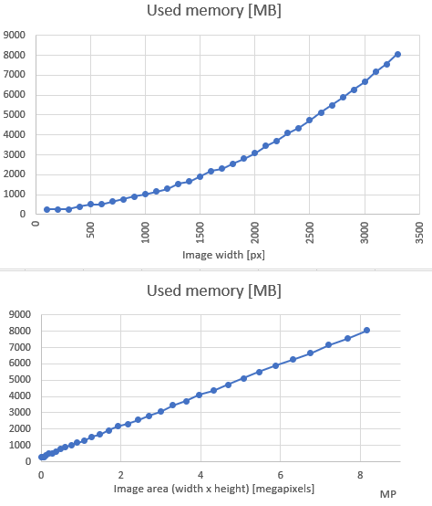
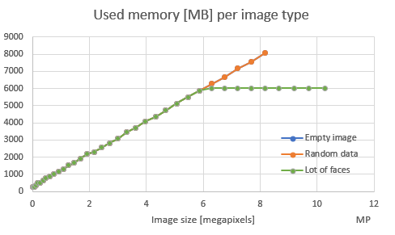
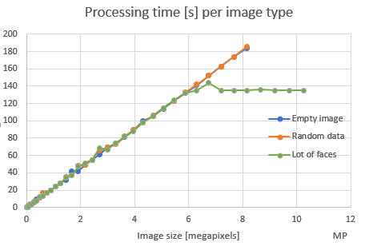
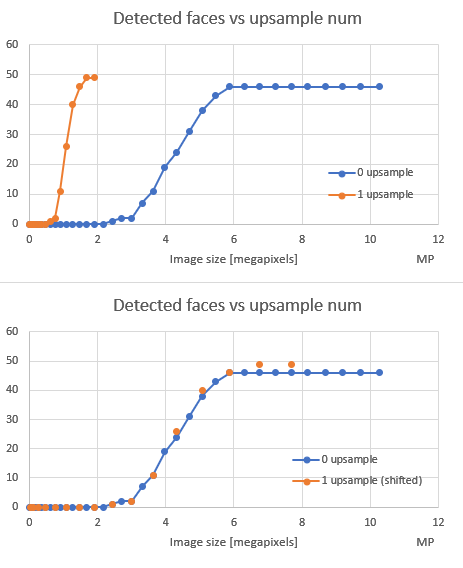
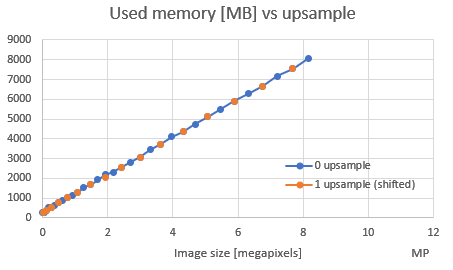
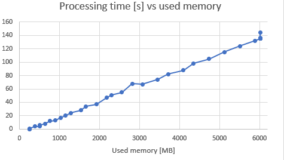
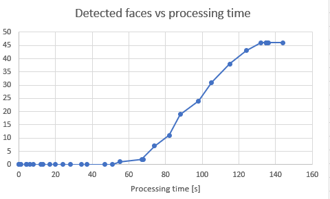

# Performance analysis of DLib’s CNN face detection

##Introduction

These days, I am working on superb new [face recognition application](https://github.com/matiasdelellis/facerecognition)
that is supposed to be embedded directly in [Nextcloud](https://nextcloud.com/) software. It is far from being done,
and I am just helping there, but we do have some grand vision:) I might talk more about it some other day, but for
now - just contact me if you find this interesting;)

Under the hood, this FaceRecognition app use [DLib](http://dlib.net/) library with
[PHP bindings for DLib](https://github.com/goodspb/pdlib). To be more precise, it is using pipeline of several steps,
but first and most important is [face detection using CNN](http://dlib.net/cnn_face_detector.py.html),
as this is most costly step.

Now, it is all fun and games when you want to use DLib internally for your own purposes together on a hardware you
know in-and-out and with images you have control over, but it is completely different challenge to do this in
generic manner, in a generic app, that should serve various people, where Nextcloud is deployed to various hardware
and software environment and where who-knows-what images DLib will be fed with.

For example, you cannot just give 8MP image (`3456×2304` for example) to DLib and expect it to work.
It will take minutes! to complete and take 10GB of RAM! As not everyone have 10GB of RAM these days,
we need to scale image first (preprocessing phase). But for how much? And what is impact of scaling down on detected
faces? What is processing time to analyze smaller images, and is it function of width/height or function of image size
(image area)? This is exactly questions that this analysis tries to answer!

## Methodology

Let’s just quickly go over what I measured and how.

### Dimensions

I tested several dimensions:
* Image size (width:height was `4:3`, and width scaled from 100px to 3800px in 100px increments.
    3800px was maximum width my setup machine, with 12GB of RAM, could handle)
* Three image types, as I wanted to see does image content make any difference for DLib:
  * Completely empty (black) image
  * Image with random data (white noise)
  * [Actual image with lot of people on it](https://commons.wikimedia.org/wiki/File:CEE_Group_photo_at_Wikimania_2016_Esino_Lario.jpg)
* With and without upsampling in DLib directly (we are going to scale down image anyway before feeding it to DLib,
    so this was to see what is a difference in performance and quality of detection with and without upsampling for
    equivalent sizes, e.g. is it better to scale down `4000×4000` to `1000×1000` and have 1 upsample in DLib,
    or just scale down directly to `2000×2000` with `0` upsamples in DLib)

I didn’t care about difference in image formats (PNG, JPG…), as DLib is internally loading and decoding image to
memory array anyway, so I suspected it will have no impact (correct me if I am wrong).

DLib can work both with and without CUDA. Since CUDA case is far forgiving on CPU (around 10x faster,
by my rough measurements) and all of the memory is offloaded to GPU, we want to focus here on case when DLib is
running on CPU (which I suspect a lot of people is running Nextcloud anyway - from Raspberries, QNAPs to hostings).

### Logic

We have two programs - one child program (`test-program.py`) that is actually doing face detection and is supposed
to be memory capped, and another program (`test-driver.py`) that is “driving” test program with various parameters.

To cap memory limits, I used Linux’s ulimits during test-program.py starting (limits are set for address space
(`resource.RLIMIT_AS`) from `preexec_fn`). To actually determine what are memory limits for a given width/height,
I used simple binary search - try with different values for memory limits and see what is minimum value where we don’t get OOM:)

Obviously, for both memory data and processing time data given below, do not read absolute values they are far too
specific for my machine. OK, sure, you might get rough estimates for your setup based on my setup, but that’s it - far
more important are readings on performance trends. If it is of any interest, my setup is AMD A10-6790K on host and
tests were run from within VBox with 1 CPU.

### Code

Whole code is written in Python and is inside `src/` directory. IT should be self-contained
(except installing `requirements.txt`), but since it is fairly small, just go ahead and fiddle with it.
**Full run take around 1.5 days on my machine.** (you have been warned!:)

## Lessons learned

Before I dive into real perf data, here are some interesting stuff I learned while writing this:

* Ulimits do not work in WSL (Windows Subsystem for Linux). No, like, no, they are completely ignored.
* Python need `-u` switch when working with `tee`. I wanted to see both results on screen and dump them in file,
    so I though that running `python3 test-program | tee out.log` will work. Turns out - no, it will not.
    You need to force unbuffered output with `-u`.
* `preexec_fn` argument in `subprocess.Popen` is really useful argument, check it out!

That being said, let’s see some graphs. First we want to see what we should match against - width of image,
or total image area (also known as image size, or total number of pixels). So, let’s see used memory per width
and per number of pixels:

Obviously, there is clear trend towards number of pixel where there is linearity. *One thing to check is - what happens
if we use images with different ratios* other than `4:3` (as in this test), like for panoramas or such, does
it change used memory? Therefore, I decided to use image area (in megapixels) in following graphs and not simple
width or height. That being said, let’s see does content of an image affects used memory and processing time:

I am not sure what these “breaks” in linearity mean - *does graph above means that current CNN in DLib has limit
to 6GB of RAM, no matter how large image we feed it*? I need to test this hypothesis! It may help with defining our
model better, but it will certainly not help 95% of the Nextcloud users.

Next, let’s see how image size affects number of detected faces:

These 2 graphs require a bit of explanation. First graph has number of detected faces for different image sizes, with
and without upsampling. But then I figured out that this type of visualization sucks and that it is better to “normalize”
image sizes by multiplying image size by `4` (upsampling incresed both width and height by `2`, so image size is
increased by `4`). This is effectively “shifting” orange dots to the right. This is how I ended up with second graph.

So, this curve of detected faces is very interesting - it is almost like `tan(x)` or some sigmoid (maybe it is?😊).
OK, this group photo has very large amount of very small faces, but what worries me is how DLib is unable to find any
face up to some point - only around 4MP (which is `2400x1800px`) we get some results. I just hope this is because of
choice of image and that ordinary images will have `[0-4]` faces in it (larger faces, mind you) and that they could be
detected with far less that 2400x1800px. *I need to conduct some other tests with other images, just to see what is sweet
spot for image size with respect to this*.

While we are talking about upsampling, let’s see how it affects used memory (remember that same
superimposition/shifting (as above) is being done here!):

I am out of nice graphs, so let’s beat a dead horse and see some other scatter plots of other dependent variables:

# Conclusions

I would say, there are couple of conclusions we can take from this:

* Both used memory and processing time is linearly dependent on image size (total number of pixels in image).
    Therefore, any model we do in Face Recognition app (to resize image to proper value) should take this into account.
* Image content does not affect neither duration nor memory needed for face detection
  * On the contrary - “normal” images can produce results faster and can require less memory (or at least after
      some huge image sizes😊)
* If we want FaceRecognition app to succeed, we need to find some automatic sweet spot, maybe read total memory
    and decide how to scale image based on that. Let’s call this “budget” (like in the sentence “our budget when
    user is having 1GB of RAM is 0.75MP”)
* I don’t think it is realistic to use DLib without (at least!) 1GB of RAM given to DLib, which I think maps to, at
    least, 2GB on a machine running Nextcloud/DLib. Even then, we need to be prepared to handle OOMs as regular stuff!
* I love this sigmoid shape of detected faces vs image size. I think there is more to it, there is probably some
    minimum face size where DLib can trigger detection. Faces on this particular image were `60-90px` when size was
    `2826x2120px`, which does stress DLib a bit😊 TODO for me is to dig into this more. Not sure what else we can do
    for customer - amount of RAM will dictate how much we need to scale images, and that will dictate how much faces
    we can detect.
* I don’t know what upsampling does under the hood, but all data above suggest it is ordinary, primitive scaling up. It
    didn’t improve detection (OK, it did a bit, found 49 compared to 46 faces without upsampling), it didn’t use less
    memory nor processing time, so I would say we should scale down on budgeted size and keep upsampling to 0. If image
    is small and we have potential to upscale it, then we should let DLib do it (for example, user’s RAM suggest we can
    budget for `1600x1200px` images. User gives us `800x400px` image, and that means we can set `upsample_num=1`. If
    user gives us `1200x800px` image, we need to keep `upsample_num=0` as total will go above our budget).
